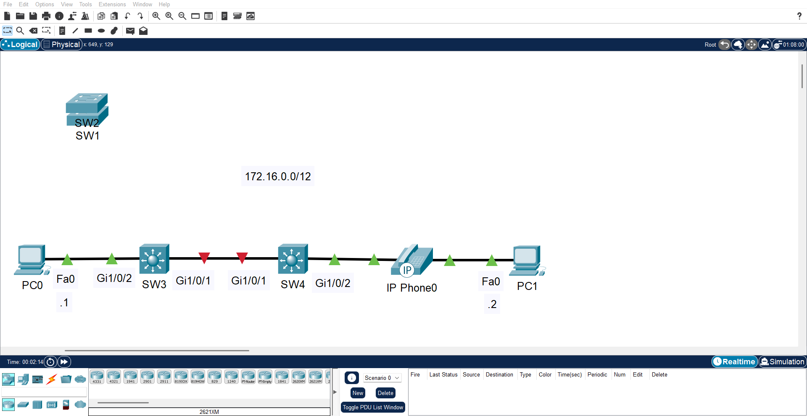

# Troubleshooting: Interface Speed and Link Establishment

## Lab File

<table align="center">
  <tr>
    <td align="center" style="padding: 15px;">
      <b>📦 Lab Environment</b> 
      Cisco Packet Tracer  
      <a href="https://github.com/Ngonal/Networking-Lab-Portfolio/raw/main/Layer%201%20-%20Physical/Interface-Speed-and-Link-Establishment/Interface-Speed-and-Link-Establishment.pkt">
        <kbd>⬇️ Download Lab File (.pkt)</kbd>
      </a>
    </td>
  </tr>
</table>

  ⚠️ The lab file is provided in its <b>initial state</b>. You may complete the objectives by following the log below or by working toward the result on your own.

## Log
### Initial State

  <table align="center">
    <tr>
      <td align="center">
        
      </td>
    </tr>
    <tr>
      <th align="left" colspan="6" style="padding: 10px 12px; background-color: #eaeef2; border-bottom: 1px solid #d0d7de; text-align: left;">
        <b>📋 Scenario:</b> Two switches were recently replaced with new hardware. Following the replacement, the interswitch link fails to establish — users on both segments lose connectivity entirely. The decommissioned switches did not exhibit this behavior.
      </th>
    </tr>
  </table>

### Steps
| Step | Observation | Action Taken | Result | Image |
|:---:|:---|:---|:---|:---:|
| 1 | `show interfaces status` on `SW3` reveals `Gi1/0/1` is hard-coded to 10 Mbps — atypical, as interfaces are expected to auto-negotiate speed by default, and immediately suggests misconfiguration; given the link is entirely down, a speed mismatch with `SW4` is suspected | Issued `speed auto` on `SW3` `Gi1/0/1`; confirmed with `show interfaces Gi1/0/1 status` | `SW3` negotiates to `SW4`'s hard-coded speed; link establishes |  |
| 2 | `show interfaces status` on `SW4` reveals `Gi1/0/1` is hard-coded to 100 Mbps — confirms the speed mismatch that caused the initial link failure | Issued `speed auto` on `SW4` `Gi1/0/1`; confirmed with `show interfaces Gi1/0/1 status` | Both interfaces now set to auto-negotiate; configuration normalized on both switches |  |
| 3 | Both hosts are now able to communicate | Tested with `ping` via Windows Command Prompt | Communication successful |  |

### Conclusion
The root cause was a speed mismatch introduced during hardware replacement:
1. **SW3 Gi1/0/1:** Hard-coded to 10 Mbps
2. **SW4 Gi1/0/1:** Hard-coded to 100 Mbps

Setting `SW3 Gi1/0/1` to auto-negotiate allowed it to match `SW4`'s hard-coded speed, restoring the interswitch link. `SW4` was subsequently set to auto-negotiate to normalize configuration across both switches.

## Bonus Tips
### Tip #1 - Hard-coded interface speeds are a red flag. Interfaces are expected to auto-negotiate speed by default — an explicit speed setting immediately suggests intentional or erroneous misconfiguration:
- **`speed 10`, `speed 100`, `speed 1000`**
Forces the speed in Mbps regardless of what the other end supports
- **`speed auto`**
Allows the interface to negotiate speed with the remote end (default behavior)

> 💡 **Quick Tip(s):** There are rare legitimate reasons to hard-code speed — older devices that do not support auto-negotiation reliably may require it. However, in modern environments both ends should always be set to `speed auto` unless there is a specific documented reason not to. If you inherit a network where speeds are hard-coded, treat it as a misconfiguration until proven otherwise.
---

  <a href="https://github.com/Ngonal/Computer-Networking-Lab-Portfolio/blob/main/README.md">🏠 Home</a> &nbsp;|&nbsp;
  <a href="../">🔙 Return</a> &nbsp;

