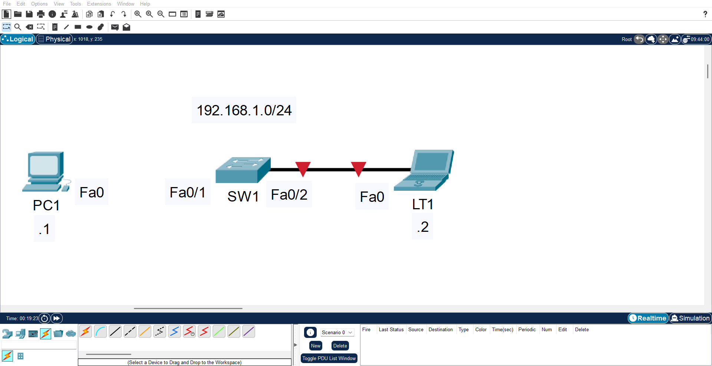
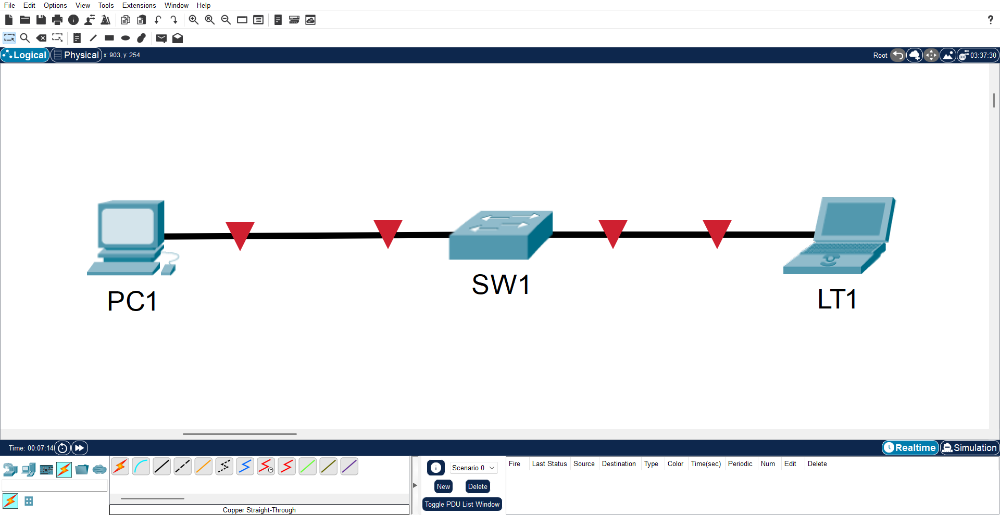
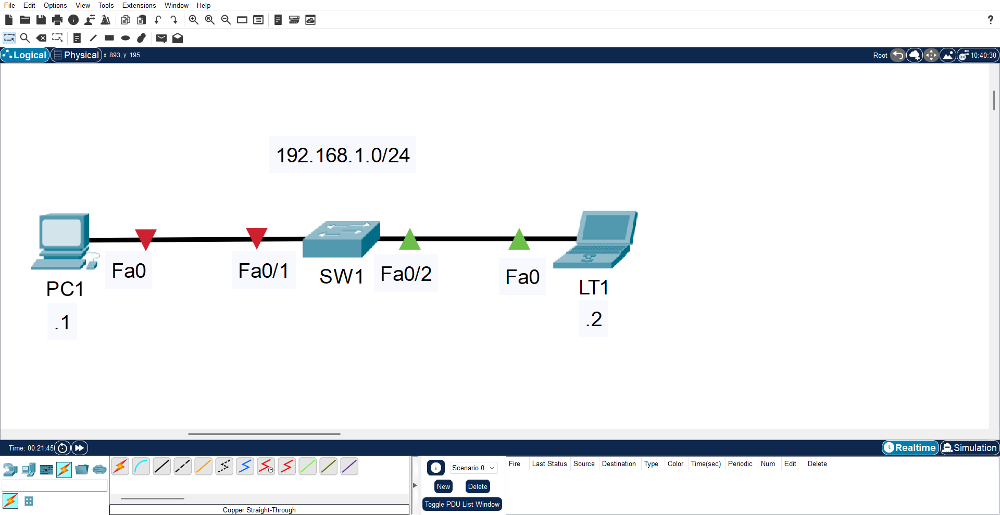
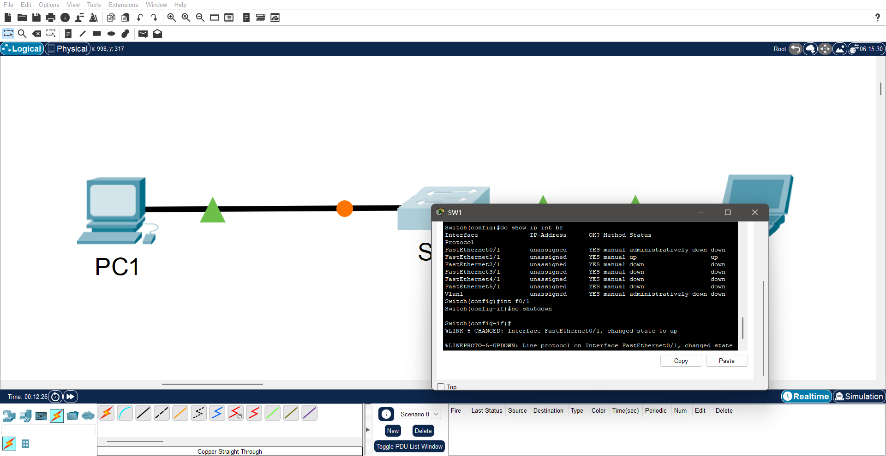
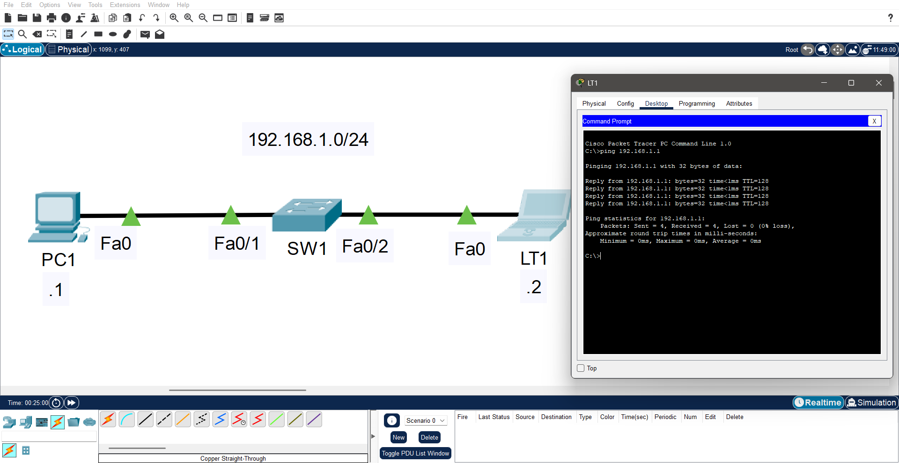

# Layer 1 Outage: Unpowered Switching Device
## Description
Two hosts are connected to a common Layer 2 device but exhibit no link-layer connectivity. All interface LEDs on the switching device are dark, suggesting an absence of electrical power. Troubleshooting focuses on power sourcing, cabling integrity, and hardware failure indicators.

## Log
### Initial State
<kbd>
  
</kbd>

### Steps
| Step | Observation | Action Taken | Result | Image |
|:---|:---|:---|:---|:---:| 
| 1 | One cable is disconnected from `Fa0/1` | Reconnected cable to `Fa0/1` | No change; switch LEDs remain unilluminated |  |
| 2 | Switch power switch is in the **OFF** position | Toggled power switch to **ON** | Some LEDs illuminate; `Fa0/1` remains dark |  |
| 3 | `Fa0/1` is administratively down | Issued `no shutdown` on interface | Port LED illuminates; link established |  |
| 4 | Both hosts have link connectivity | Tested with `ping` | Communication successful |  |

## Analysis
The root cause was a combination of Layer 1 failures:
1. **Physical:** Disconnected cable and unpowered switch
2. **Administrative:** Interface in `shutdown` state

All three conditions required correction to restore full connectivity.

---

  <a href="https://github.com/Ngonal/Computer-Networking-Lab-Portfolio/blob/main/README.md">🏠 Home</a> &nbsp;|&nbsp;
  <a href="../">📁 Layer 1 - Physical</a> &nbsp; |&nbsp;
  <a href="../../Layer 2 - Data Link/">📁 Layer 2 - Data Link</a> &nbsp; |&nbsp;
  <a href="../../Layer 3 - Network/">📁 Layer 3 - Network</a> &nbsp; |&nbsp;
  <a href="../../Layer 4 - Transport/">📁 Layer 4 - Transport</a> &nbsp; |&nbsp;
  <a href="../../Layer 5 - Application/">📁 Layer 5 - Application</a> &nbsp;

