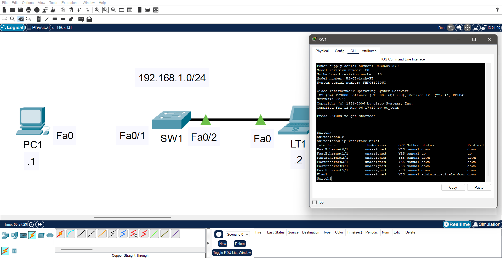

# Layer 1 Outage: Unpowered Switching Device

## Lab File
<table align="center">
  <tr>
    <td align="center" style="padding: 15px;">
      <b>📦 Lab Environment</b> 
      Cisco Packet Tracer  
      <a href="https://github.com/Ngonal/Networking-Lab-Portfolio/raw/main/Layer%201%20-%20Physical/Layer%201%20Outage:%20Unpowered%20Switching%20Device/Layer%201%20Outage%20Unpowered%20Switching%20Device.pkt">
        <kbd>⬇️ Download Lab File (.pkt)</kbd>
      </a>
    </td>
  </tr>
</table>

  ⚠️ The lab file is provided in its <b>initial state</b>. If you would like to complete the objectives, follow the log below.

## Scenario
Two hosts are connected to a common Layer 2 device that exhibits no link-layer connectivity. All interface LEDs on the switching device are dark, suggesting an absence of electrical power. Troubleshooting focuses on power sourcing, cabling integrity, and hardware failure indicators.

## Log
### Initial State
<kbd>
  
</kbd>

### Steps
| Step | Observation | Action Taken | Result | Image |
|:---:|:---|:---|:---|:---:| 
| 1 | `SW1` is plugged into electrical outlet, verified electrical outlet is working using a known-good device (receptable tester/phone charger connected to phone), reconnected power cable to no effect, `SW1` power switch is in the **OFF** position | Toggled power switch to **ON** | `Fa0/2` LEDs illuminate; `Fa0/1` remains unlit |  |
| 2 | Cable connecting `PC1` to `SW1` via `Fa0/1` is disconnected | Reconnected cable to `Fa0/1` | No change; `Fa0/1` LEDs remain unilluminated |  |
| 3 | `Fa0/1` is administratively down | Issued `no shutdown` on interface | Port LED illuminates; link established |  |
| 4 | Both hosts have link connectivity | Tested with `ping` | Communication successful |  |

## Bonus Tips
### Tip #1 - The `show ip interface brief` command provides a quick health check of all interfaces. A status of **`down/down`** indicates a Layer 1 issue:

- **Administratively Down / Down** — Interface is disabled with `shutdown` command
- **Down / Down (with cable connected)** — Possible faulty cable, incorrect cable type, or defective interface
- **Down / Down (no cable)** — No physical connection detected

> 💡 **Quick Tip:** To isolate whether the issue is the cable or the interface, swap with a **known-good cable**:
> - If the link comes up → Original cable was faulty
> - If the link remains down → Interface or connected device may be defective

<kbd>
  
</kbd>

  <i>Example: Fa0/1 showing "down/down" status after issuing `no shutdown`</i>

## Conclusion
The root cause was a combination of Layer 1 failures:
1. **Physical:** Disconnected cable and unpowered switch
2. **Administrative:** Interface in `shutdown` state

All three conditions required correction to restore full connectivity.

---

  <a href="https://github.com/Ngonal/Computer-Networking-Lab-Portfolio/blob/main/README.md">🏠 Home</a> &nbsp;|&nbsp;
  <a href="../">🔙 Return</a> &nbsp;

