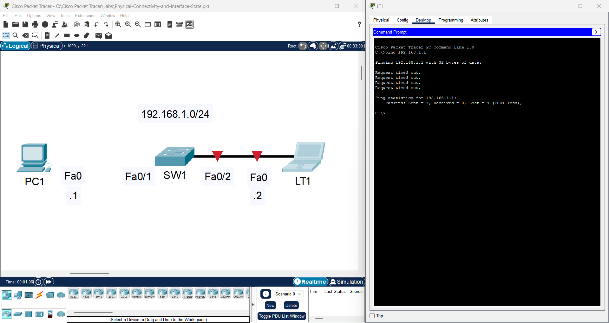
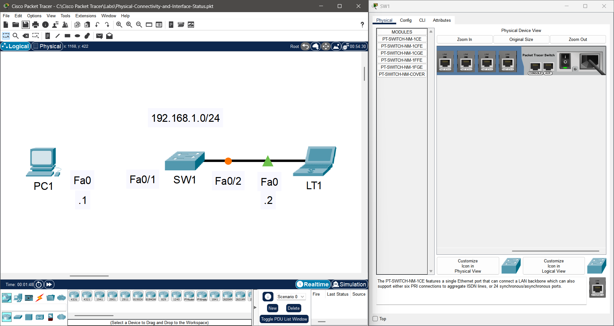
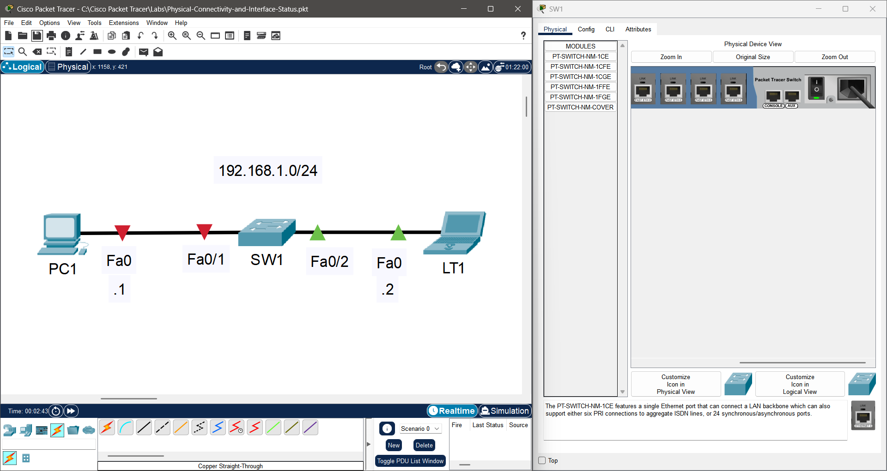
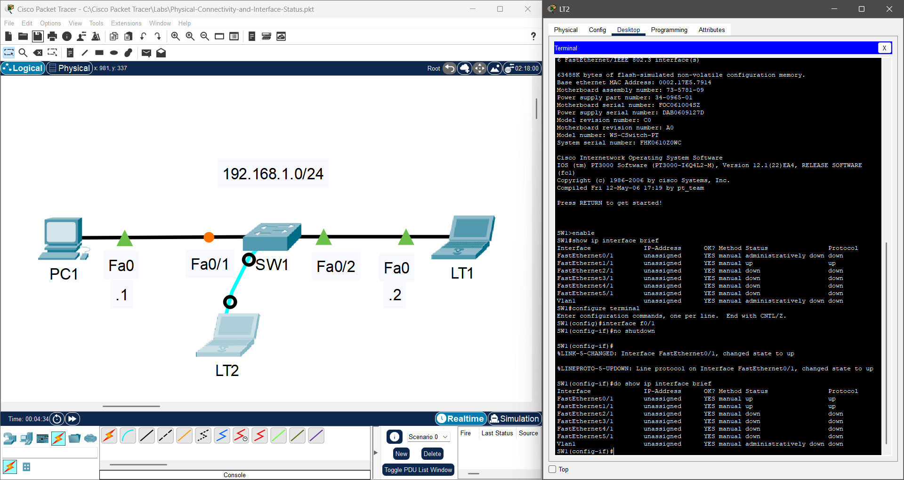
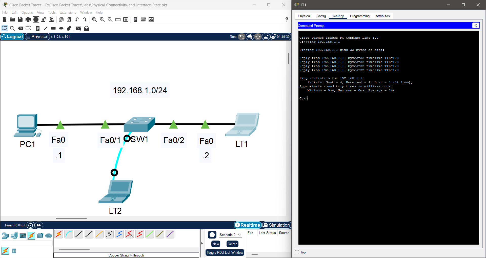
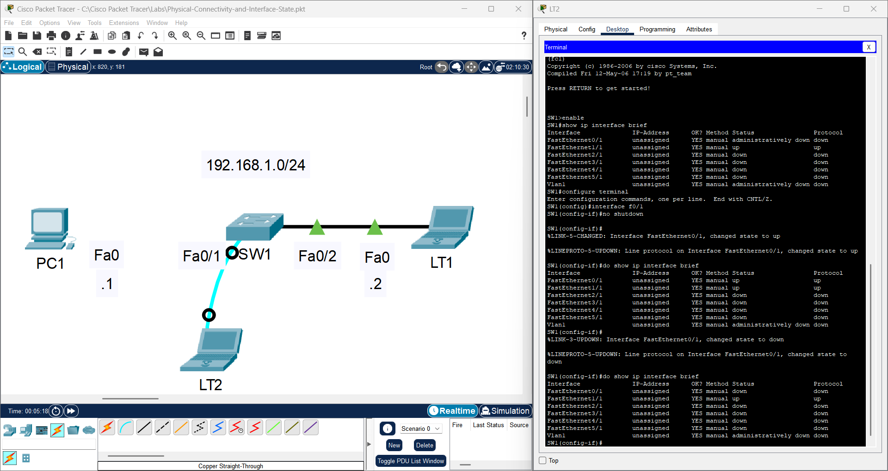

# Troubleshooting: Physical Connectivity and Interface Status

## Lab File

<table align="center">
  <tr>
    <td align="center" style="padding: 15px;">
      <b>📦 Lab Environment</b> 
      Cisco Packet Tracer  
      <a href="https://github.com/Ngonal/Networking-Lab-Portfolio/raw/main/Layer%201%20-%20Physical/Physical-Connectivity-and-Interface-Status/Physical-Connectivity-and-Interface-Status.pkt">
        <kbd>⬇️ Download Lab File (.pkt)</kbd>
      </a>
    </td>
  </tr>
</table>

  ⚠️ The lab file is provided in its <b>initial state</b>. You may complete the objectives by following the log below or by working toward the result on your own.

## Log
### Initial State

  <table align="center">
    <tr>
      <td align="center">
          
      </td>
    </tr>
    <tr>
      <th align="left" colspan="6" style="padding: 10px 12px; background-color: #eaeef2; border-bottom: 1px solid #d0d7de; text-align: left;">
        <b>📋 Scenario:</b> Two hosts connected to a common Layer 2 device are unable to communicate with each other. The device exhibits no link-layer connectivity, and all interface LEDs on the switching device are dark — suggesting an absence of electrical power.
      </th>
    </tr>
  </table>

### Steps
| Step | Observation | Action Taken | Result | Image |
|:---:|:---|:---|:---|:---:| 
| 1 | `SW1` is plugged into electrical outlet, verified electrical outlet is working using a known-good device (receptable tester/phone charger connected to phone), reconnected power cable to no effect, `SW1` power switch is in the **OFF** position | Toggled power switch to **ON** | `Fa0/2` LEDs illuminate; `Fa0/1` remains unlit |  |
| 2 | Local RJ45 connector is fully seated in `SW1`'s `Fa0/1`, TDR device indicates an open circuit on the far end of the physical link, remote end found disconnected from `PC1`'s `Fa0`, the end user reports accidental disconnection of the RJ45 connector | Reconnected cable to `PC1`'s `Fa0` to close the electrical circuit loop | No change; `Fa0/1` LEDs remain unilluminated |  |
| 3 | Connecting to the device's CLI terminal through the console port and using the `show ip interface brief` command to check interface status reveals that `Fa0/1`'s link status is administratively down | Issued `no shutdown` on interface | Link status and line protocol are up/up — the port LED is illuminated, indicating that a link has been successfully established. |  |
| 4 | Both hosts appear to have link connectivity according to their blinking interface LEDs | Tested communication using `ping` via Windows Command Prompt | Communication successful — `write` executed to save configuration state on all updated devices. |  |

### Conclusion
The root cause was a combination of Layer 1 failures:
1. **Physical:** Disconnected cable and unpowered switch
2. **Administrative:** `shutdown` applied to interface

All three conditions required correction to restore full connectivity.

## Bonus Tips
### Tip #1 - The `show ip interface brief` command provides a quick health check of all interfaces. For diagnosing Layer 1 issues, check the link status and line protocol columns:
- **Administratively Down / Down** — Interface is disabled with `shutdown` command
- **Down / Down** — No physical connection detected — There may be no cable, cable may be damaged, connectors improperly seated, wrong cable type or pinout, or the remote device may be powered off or have a defective port

  <table align="center">
    <tr>
      <td align="center">
        
      </td>
    </tr>
    <tr>
      <th width="800" align="left" colspan="6" style="padding: 10px 12px; background-color: #eaeef2; border-bottom: 1px solid #d0d7de; text-align: left;">
        <i>Example: Despite issuing `no shutdown`, interface Fa0/1 remains in a down/down state because the cable is disconnected</i>
      </th>
    </tr>
  </table>

> 💡 **Quick Tip(s):** A cable connects two devices. If the link doesn't come up, the fault could be the cable or lack of, the local device, the remote device, or **any of their respective interfaces**. Troubleshooting steps:
> - Ensure that there is a connected cable
> - Ensure that the cable is firmly seated
> - **If you have a TDR (Time Domain Reflectometer) for copper or OTDR (Optical Time Domain Reflectometer) for fiber** — use it first to check for shorts, opens, or breaks along the cable run — this can reveal faults on the far end without physically accessing it — Most modern cable testers include built-in TDR/OTDR functionality, and some switches/routers have built-in TDR/OTDR diagnostic commands
>   - **If you don't have a TDR/OTDR** — skip directly to replacing the cable with a known-good cable
>   - **If TDR/OTDR shows a fault** (open, short, impedance mismatch, fiber break) → Replace cable with a known-good cable
>   - **If TDR/OTDR shows clean results** (proper termination, no faults detected) → Skip cable replacement and proceed to device/interface investigation
> - **After cable replacement:**
>   - Link comes up → Original cable was faulty (resolved)
>   - Link remains down → Investigate both devices and their interfaces on each end (speed/duplex, disabled ports, configuration mismatches, hardware failure)

---

  <a href="https://github.com/Ngonal/Computer-Networking-Lab-Portfolio/blob/main/README.md">🏠 Home</a> &nbsp;|&nbsp;
  <a href="../">🔙 Return</a> &nbsp;

