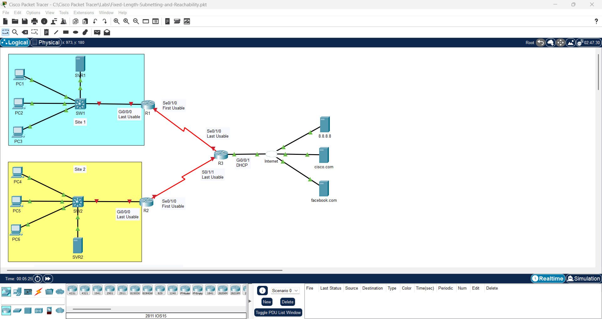
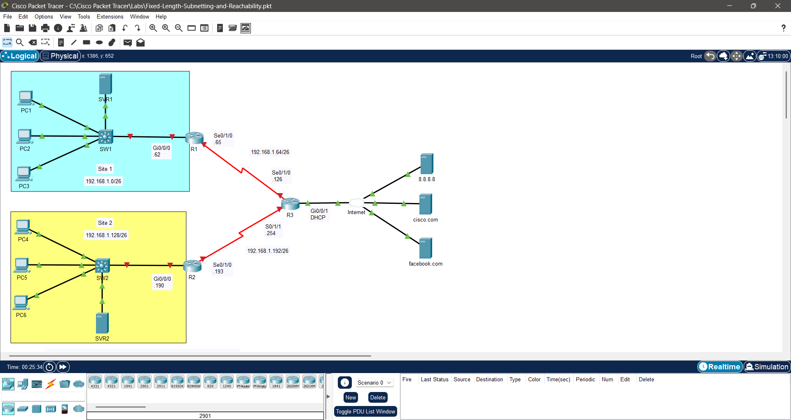
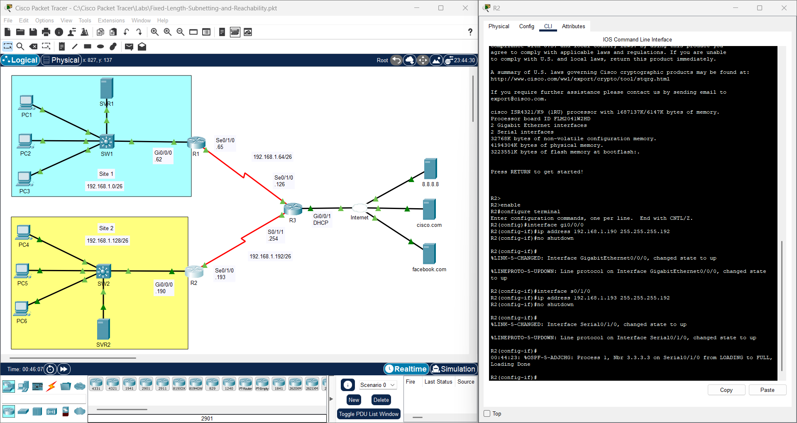
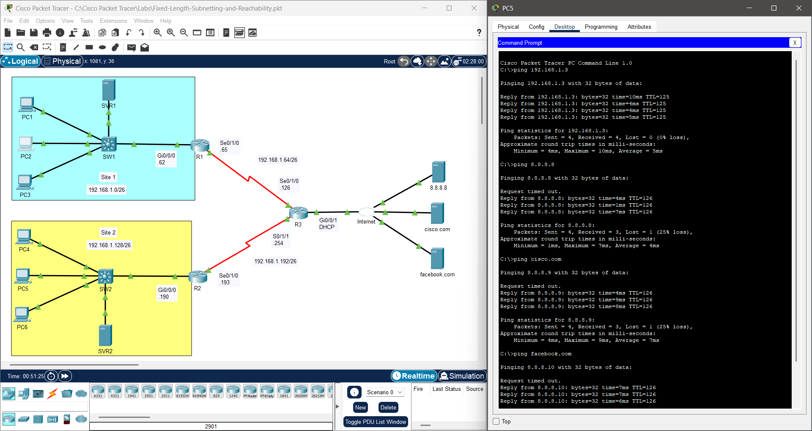
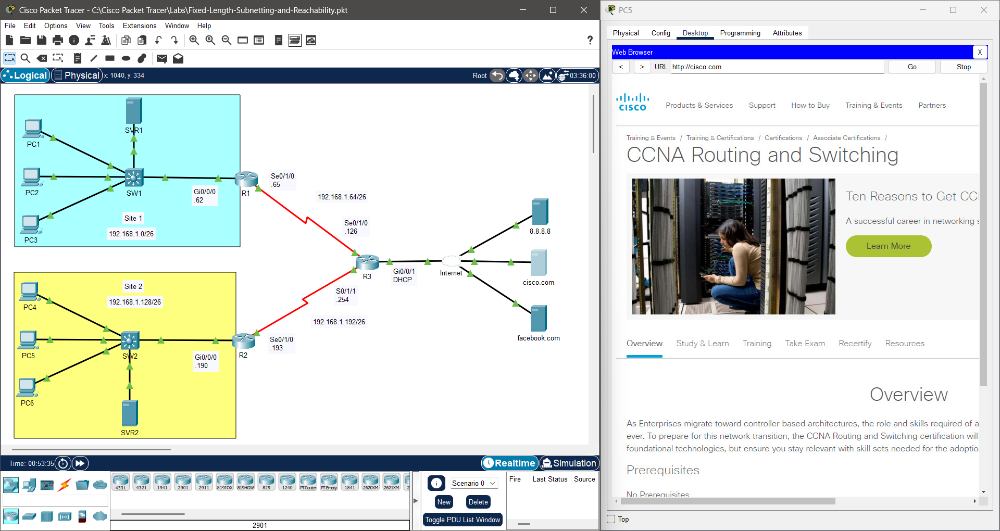

# Provisioning: Fixed Length Subnetting and Reachability

## Lab File

<table align="center">
  <tr>
    <td align="center" style="padding: 15px;">
      <b>📦 Lab Environment</b> 
      Cisco Packet Tracer
       
      Lab Author ~ David Bombal  
      <a href="https://github.com/Ngonal/IT-Portfolio/raw/main/Layer%203%20-%20Network/Fixed-Length-Subnetting-and-Reachability-(1)/Fixed-Length-Subnetting-and-Reachability-(1).pkt">
        <kbd>⬇️ Download Lab File (.pkt)</kbd>
      </a>
    </td>
  </tr>
</table>

  ⚠️ The lab file is provided in its <b>initial state</b>. You may complete the objectives by following the log below or by working toward the result on your own.

## Action Log
### Initial State

  <table align="center">
    <tr>
      <td align="center">
          
      </td>
    </tr>
    <tr>
      <th align="left" colspan="6" style="padding: 10px 12px; background-color: #eaeef2; border-bottom: 1px solid #d0d7de; text-align: left;">
        <b>📋 Scenario:</b> Network engineers have deployed new infrastructure connecting two sites through a central router topology and subdivided the 192.168.1.0/24 network into four equal-sized subnets. The network diagram requires updated subnet labeling, and router interfaces need IP address assignments within their respective subnets to establish inter-network connectivity.
      </th>
    </tr>
  </table>

### Entries
| # | Notes | Action Taken | Result | Image |
|:---:|:---|:---|:---|:---:|
| 1 | The network diagram reflects a partially updated topology | Subnetted 192.168.1.0/24 into four equal /26 subnets by borrowing two host bits: 192.168.1.0/26, 192.168.1.64/26, 192.168.1.128/26, 192.168.1.192/26 — labeled each subnet and interface accordingly | Network diagram updated to reflect the new addressing scheme |  |
| 2 | After assigning IP addresses to `R1`'s `Gi0/0/0` and `Se0/1/0` via `ip address <IP address> <IP subnet mask>`, both links remain down — `show ip interface brief` confirms that these interfaces are administratively disabled | Assigned IP addresses and issued `no shutdown` on both interfaces; repeated procedure for `R2` and `R3` | All interfaces assigned IP addresses within their respective subnets; all links active and OSPF adjacencies formed between routers according to Syslog messages |  |
| 3 | Testing connectivity from `PC5` to remote hosts and servers across both sites | Tested communication using `ping` via Windows Command Prompt | Communication successful — `write` executed to save configuration state on all updated devices |  |
| 4 | Application Layer connectivity not yet verified | Visited Cisco.com via web browser | HTTP response received successfully — Application Layer confirmed operational |  |

### Conclusion
The provisioning tasks required to establish inter-network connectivity were completed in the following order:
1. **Subnetting:** 192.168.1.0/24 subdivided into four equal /26 subnets and network diagram amended
2. **Addressing:** IP addresses assigned to all router interfaces within their respective subnets
3. **Activation:** Administratively down interfaces brought up with `no shutdown`
---

  <a href="../../README.md">🏠 Home</a> &nbsp;|&nbsp;
  <a href="../">🔙 Return</a> &nbsp;

