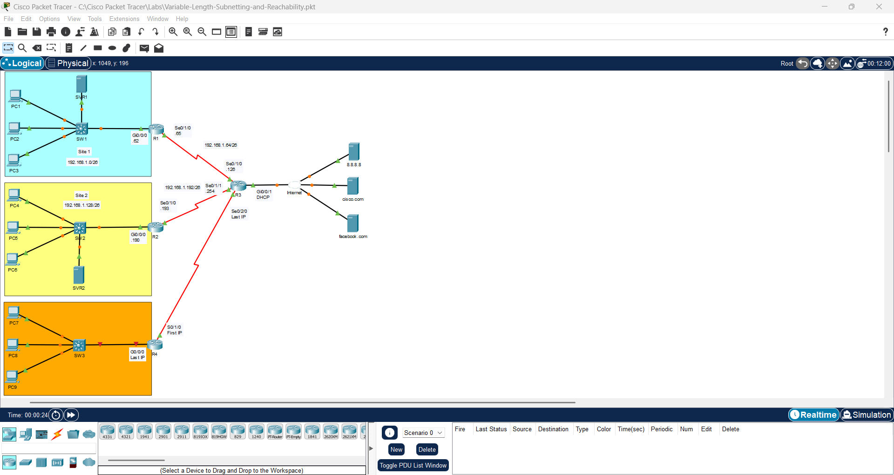
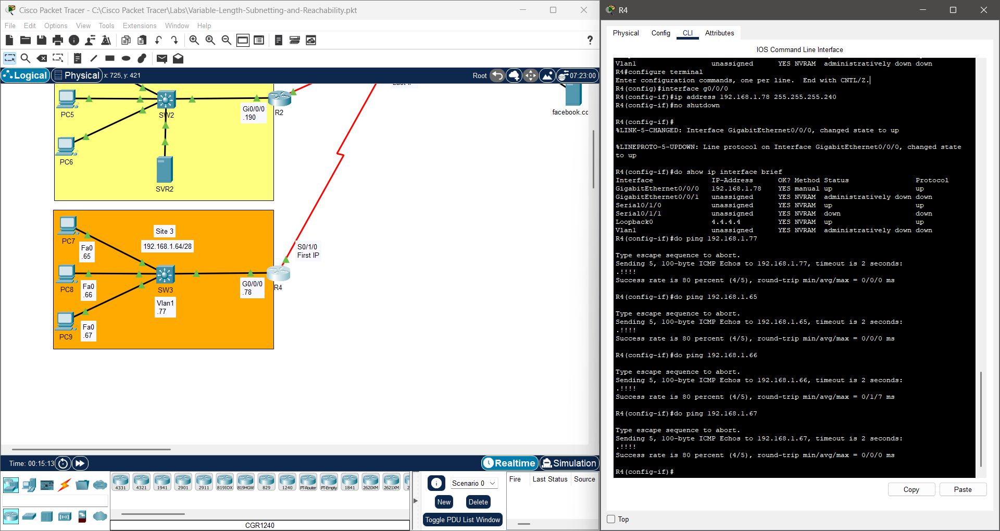
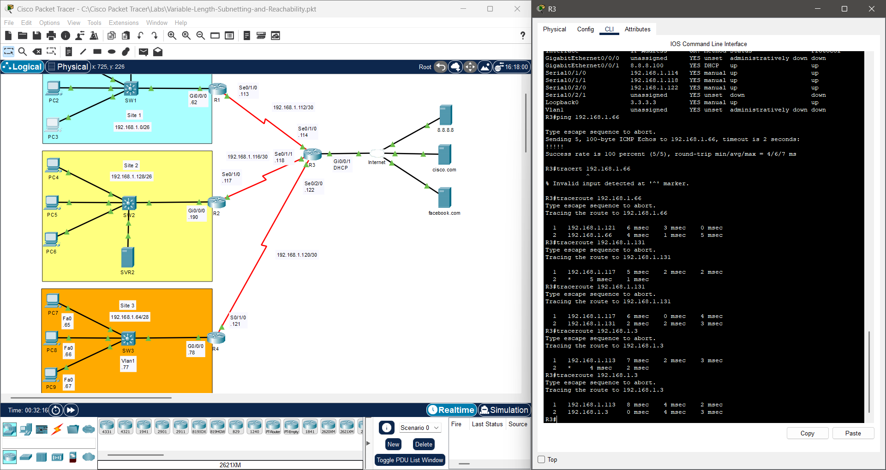
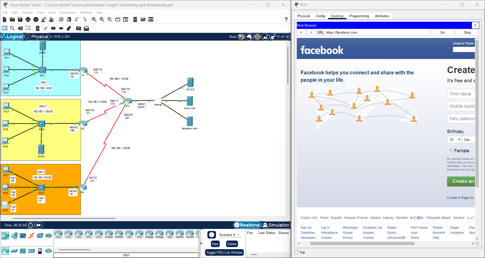

# Provisioning: Variable Length Subnetting and Reachability

## Lab File

<table align="center">
  <tr>
    <td align="center" style="padding: 15px;">
      <b>📦 Lab Environment</b> 
      Cisco Packet Tracer
       
      Lab Author ~ David Bombal  
      <a href="https://github.com/Ngonal/IT-Portfolio/raw/main/Layer%203%20-%20Network/Variable-Length-Subnetting-and-Reachability/Variable-Length-Subnetting-and-Reachability.pkt">
        <kbd>⬇️ Download Lab File (.pkt)</kbd>
      </a>
    </td>
  </tr>
</table>

  ⚠️ The lab file is provided in its <b>initial state</b>. You may complete the objectives by following the log below or by working toward the result on your own.

## Action Log
### Initial State

  <table align="center">
    <tr>
      <td align="center">
          
      </td>
    </tr>
    <tr>
      <th align="left" colspan="6" style="padding: 10px 12px; background-color: #eaeef2; border-bottom: 1px solid #d0d7de; text-align: left;">
        <b>📋 Scenario:</b> A 192.168.1.0/24 network was previously subnetted into four equal /26 subnets to support an initial deployment. A newly installed site requires an additional subnet carved from the same address space — one of the existing /26 subnets must be broken down into the maximum number of subnets supporting at least 8 hosts each. The last of those resulting subnets must be further subdivided into /30s to accommodate point-to-point links and conserve address space.
      </th>
    </tr>
  </table>

### Entries
| # | Notes | Action Taken | Result | Image |
|:---:|:---|:---|:---|:---:|
| 1 | Site 3 requires at least 8 host addresses — 3 PCs, `R3`'s `Gi0/0/0`, `SW3`'s management address, and 3 reserved for future growth — a minimum of 4 host bits must remain unborrowed from the available 6 in the /26 (2⁴ - 2 = 14 usable hosts); borrowing 2 bits yields four /28 subnets: 192.168.1.64/28, 192.168.1.80/28, 192.168.1.96/28, and 192.168.1.112/28 | Assigned 192.168.1.64/28 to Site 3 — updated network diagram labeling and assigned host addresses accordingly; verified allocation by pinging all assigned addresses from `R4` | All hosts on Site 3 reachable — network diagram updated to reflect new addressing scheme |  |
| 2 | Three point-to-point links require /30 subnets — borrowing 2 bits from 192.168.1.112/28 yields four /30 subnets (2² - 2 = 2 usable hosts each): 192.168.1.112/30, 192.168.1.116/30, 192.168.1.120/30, and 192.168.1.124/30 | Assigned /30 subnets to each point-to-point link — updated diagram labeling and reassigned first and last usable addresses to each interface; verified from internet router `R3` by using `traceroute` command to hosts on each respective subnet | All point-to-point links addressed correctly — address space conserved |  |
| 3 | Application Layer connectivity not yet verified | Visited facebook.com via web browser | HTTP response received successfully — Application Layer confirmed operational |  |

### Conclusion
The provisioning tasks required to establish inter-network connectivity were completed in the following order:
1. **Subnetting:** 192.168.1.0/24 subdivided into four equal /26 subnets and network diagram amended
2. **Addressing:** IP addresses assigned to all router interfaces within their respective subnets
3. **Activation:** Administratively down interfaces brought up with `no shutdown`
---

  <a href="../../README.md">🏠 Home</a> &nbsp;|&nbsp;
  <a href="../">🔙 Return</a> &nbsp;

